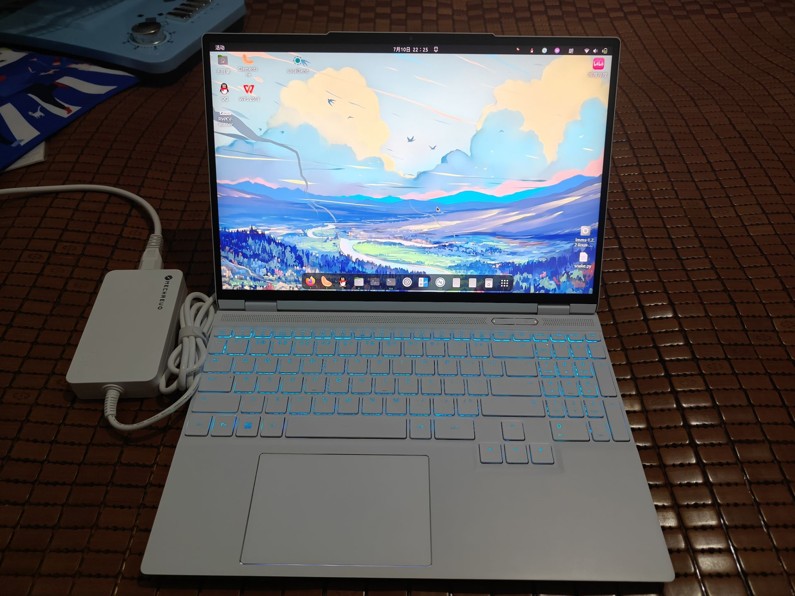
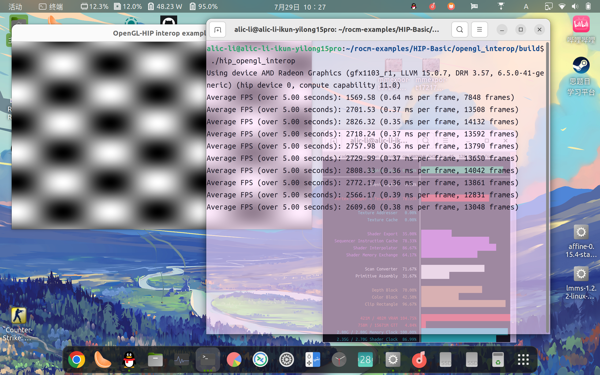

+++
title = 'Run RWKV-6 14b Language model on AMD R7 8845hs 780M by use AI00 💫'
date = 2024-09-05T09:59:04+08:00
categories = [
    "RWKV",
    "AI100",
    "780M",
    "AMD",
    "Radeon",
    "IGPU"
]
tags = [
    "RWKV",
    "AI100",
    "780M",
    "AMD",
    "Radeon",
    "IGPU"
]
image = "8845h.png"
+++

### Test platform 🐔Mechanical Revolution Pterosaur 15pro 8845h with Radeon-780m integrated graphics🚀, 32Gddr5-5600mhz memory, RTX4060-laptop (Disabled by me in Bios, Because of Nvidia Fuck You!!!)😝
- Because I just graduated from high school this year, I bought an all-around laptop. I was originally a loyal Radeon user, but because AMD does not adapt the laptop's mobile graphics card to the mainstream machine learning framework, my Radeon780M can perfectly install ROCm6.1 on Ubuntu, but!!! The ROCm software stack can be called normally, but pytorch said that this core is not supported by me at all. . . (As shown below) So I bought Uncle Huang's 4060 laptop, and found that Uncle Huang's card is really useful~😋

### This official hip test example can run perfectly, and even the core can be identified, which is extremely abstract😂


### Let's get started! ! ! 🤗
- Author's warehouse address https://github.com/Ai00-X/ai00_server/
- If you run it, you can run it without installing torch, because it calls Vulka's API, so it can basically run on any computer or graphics card, so let's cheer for the Vulkan organization and the RWKV community! ! ! 🎉 And don't forget my Mozilla organization🦊
- During the installation process, you only need to download the Releases of the corresponding operating system from the project repository, or you can compile it yourself to start it😊
- The documentation is very well written, so I won't go into details here❤️
- Just run it in the project folder👀
```bash
./ai00_rwkv_server
```
- Open the browser and enter http://localhost:65530 to enter the management webui panel
### Parameter setting🤔
- As shown in the figure: we select the model file in the safe tensor format of 14b. If it is a .pth model file, it needs to be converted
- I can run 5 tokens/s with 32g memory and 14b using nf4 quantization, and the power consumption is only a little more than 40w, which is very amazing 🔥
- Can it be said that it can run 4090-level model parameters? 😜
- 
### Model conversion 📒

This project currently only supports Safetensors models with the `.st` suffix. Models with the `.pth` suffix saved through `torch` need to be converted before use.

1. [Download the pth model](https://huggingface.co/BlinkDL)

2. Clone or download the [convert2ai00.py](./convert2ai00.py) or [convert_safetensors.py](./convert_safetensors.py) program in this repository and install the corresponding dependent libraries (`torch` and `safetensors`)

3. Run the above program and specify the input and output paths

```bash
$ python convert_safetensors.py --input ./filename.pth --output ./filename.st
```

4. If you don't want to install Python or Torch, you can go to [`web-rwkv`](https://github.com/cryscan/web-rwkv/releases) and download the converter `web-rwkv-converter` which does not depend on Python or Torch

```bash
$ ./web-rwkv-converter --input /path/to/model.pth --output /path/to/model.st
```

5. According to the above steps, put the converted `.st` model file in the `assets/models/` path and modify the model path in [`assets/Config.toml`](./assets/Config.toml)

### Model path💾
You can modify the model configuration in ```./assets/configs/Config.toml```, including model path, number of quantization layers, etc.
```python
[model]
embed_device = "Cpu" # Device to put the embed tensor ("Cpu" or "Gpu").
max_batch = 8 # The maximum batches that are cached on GPU.
name = "RWKV-x060-World-3B-v2.1-20240417-ctx4096.st" # Name of the model.
path = "/media/alic-li/B8E84E9EE84E5B30/rwkv-models/" # Path to the folder containing all models.
precision = "Fp16" # Precision for intermediate tensors ("Fp16" or "Fp32"). "Fp32" yields better outputs but slower.
quant = 0 # Layers to be quantized.
quant_type = "Int8" # Quantization type ("Int8" or "NF4").
stop = ["\n\n"] # Additional stop words in generation.
token_chunk_size = 128 # Size of token chunk that is inferred at once. For high end GPUs, this could be 64 or 128 (faster).

```
### Run the model
- I think the function of writing papers is a major feature of the AI00 project~ 🥰
- It feels good to write~ It has a strong flavor of Chinese textbooks🤣
- And it can automatically generate outlines✨
- But remember to generate the outlines in batches with the same title. I put them all in at the same time and encountered some minor bugs. 3~4 points each time👀
### Ok! That is all!!! 🫡
##### If you have any questions, remember to discuss in the comment area~ 👀