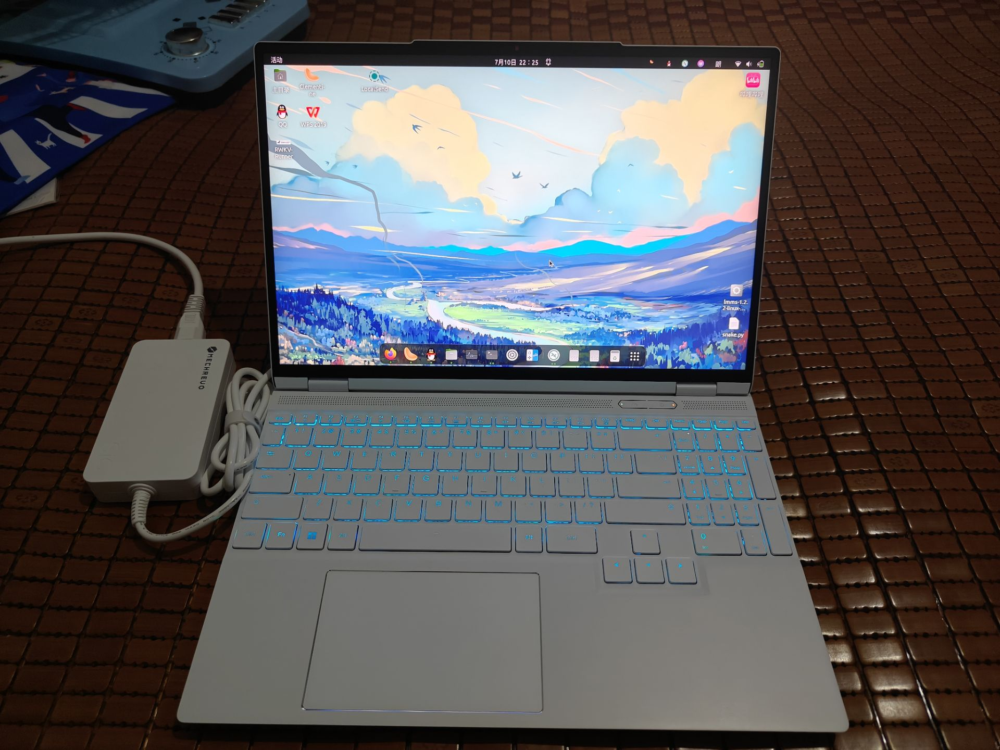
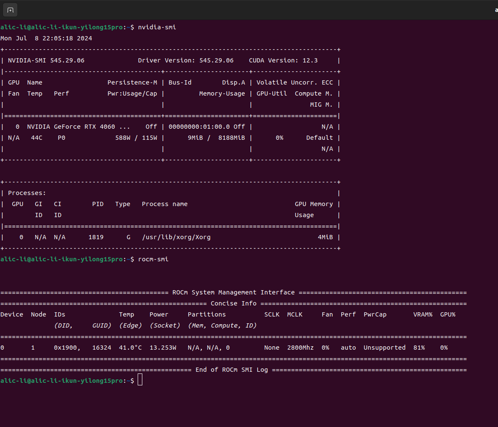
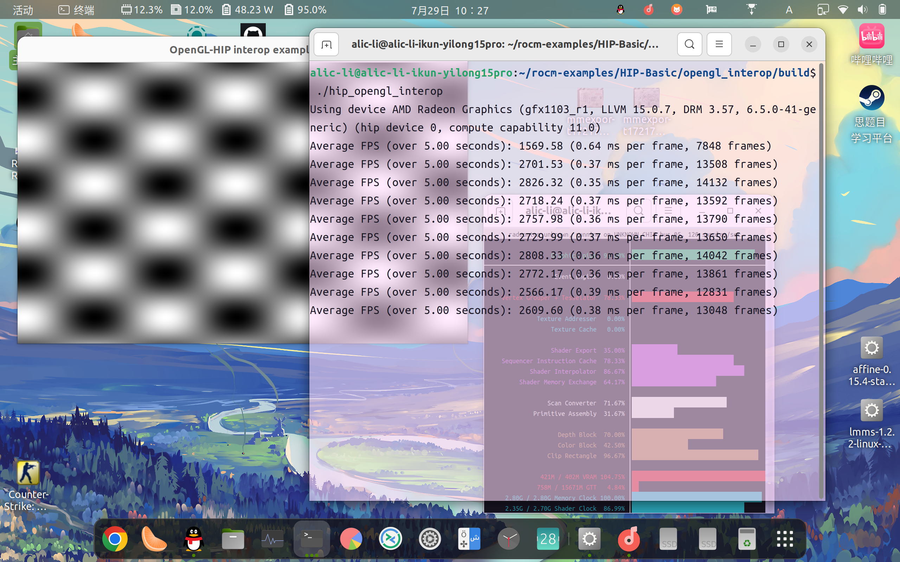
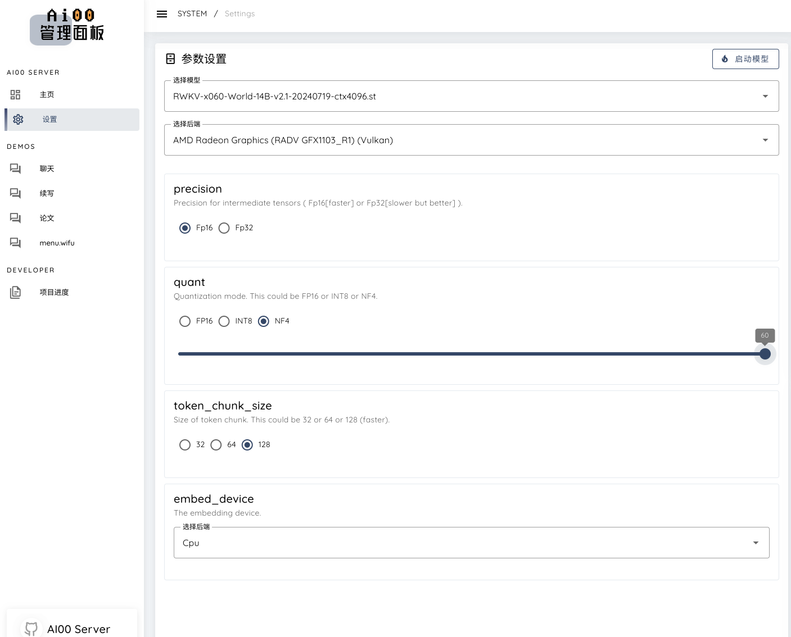

+++
title = '在AMD R7-8845hs-780M核显上使用AI00项目运行RWKV v6-14b大语言模型💫'
date = 2024-09-05T09:59:04+08:00
categories = [
    "RWKV",
    "AI100",
    "780M",
    "AMD",
    "Radeon",
    "IGPU"
]
tags = [
    "RWKV",
    "AI100",
    "780M",
    "AMD",
    "Radeon",
    "IGPU"
]
image = "8845h.png"
+++

### 测试平台 🐔机械革命翼龙15pro 8845h带Radeon-780m核显🚀，32Gddr5-5600mhz内存，RTX4060-laptop(被我毙了Because of Nvidia Fuck You!!!)😝
- 因为我今年刚刚高中毕业，所以就买了台全能本，我本来是一个忠实的Radeon用户，但是由于抽象的AMD不把laptop的移动端显卡做主流机器学习框架适配，我这Radeon780M都可以再ubuntu上完美安装好ROCm6.1,但是！！！这ROCm软件堆栈都可以正常调用的，但这pytorch表示这核心我死活不支持。。。（如下图）所以还是买了黄舅舅的4060laptop，结果发现黄舅舅的卡真好用~😋

### 这跑个官方的hip测试例子都是可以完美运行的，甚至还可以识别出核心，抽象至极😂


### 那就让我们开始吧！！！🤗
- 作者仓库地址https://github.com/Ai00-X/ai00_server/
- 运行的话不用装torch也能跑，应为调用的是Vulka的API，所以说是台电脑是张显卡基本上都能跑，所以说让我们为Vulkan组织和RWKV社区欢呼吧！！！🎉还有别忘了我的Mozilla组织🦊
- 安装过程只需要下载项目仓库的对应操作系统的Releases即可，也可以自行编译来启动😊
- 文档写的很棒这里我就不多赘述了❤️
- 直接再该项目文件夹下运行即可👀
  ```bash     
    ./ai00_rwkv_server
    ```
- 打开浏览器进入http://localhost:65530就可以进入管理webui面板了
### 参数设置🤔
- 如图所示：我们选14b的safe tensor格式的模型文件，如果是.pth的模型文件则需要转换
- 我32g内存跑14b使用nf4量化可以跑 5 tokens/s 而且就只有40w多一点的功耗，十分逆天 🔥
- 这样能不能可以说是能跑4090级模型参数了 😜
- 
### 模型转换📒

本项目目前仅支持`.st`后缀的 Safetensors 模型，通过`torch`保存的`.pth`后缀模型需要在使用前进行转换。

1. [下载pth模型](https://huggingface.co/BlinkDL)

2. 克隆或下载本仓库下[convert2ai00.py](./convert2ai00.py)或[convert_safetensors.py](./convert_safetensors.py)程序，并安装相应的依赖库（`torch`和`safetensors`）

3. 运行上述程序，并指定输入输出路径

    ```bash
    $ python convert_safetensors.py --input ./filename.pth --output ./filename.st
    ```

4. 如果你不想安装 Python 或 Torch，可以前往[`web-rwkv`](https://github.com/cryscan/web-rwkv/releases)并下载不依赖于 Python 或 Torch 的转换器`web-rwkv-converter`

    ```bash
    $ ./web-rwkv-converter --input /path/to/model.pth --output /path/to/model.st
    ```

5. 根据上文步骤，将转换所得的`.st`模型文件放在`assets/models/`路径下，并修改  [`assets/Config.toml`](./assets/Config.toml) 中的模型路径

### 模型路径💾
可以修改 ```./assets/configs/Config.toml```里面的模型配置，包括模型路径、量化层数等
```python
[model]
embed_device = "Cpu"                                 # Device to put the embed tensor ("Cpu" or "Gpu").
max_batch = 8                                        # The maximum batches that are cached on GPU.
name = "RWKV-x060-World-3B-v2.1-20240417-ctx4096.st" # Name of the model.
path = "/media/alic-li/B8E84E9EE84E5B30/rwkv-models/"                               # Path to the folder containing all models.
precision = "Fp16"                                   # Precision for intermediate tensors ("Fp16" or "Fp32"). "Fp32" yields better outputs but slower.
quant = 0                                            # Layers to be quantized.
quant_type = "Int8"                                  # Quantization type ("Int8" or "NF4").
stop = ["\n\n"]                                      # Additional stop words in generation.
token_chunk_size = 128                               # Size of token chunk that is inferred at once. For high end GPUs, this could be 64 or 128 (faster).

```
### 运行模型
- 我觉得写论文的功能是AI00项目的一大特色功能捏~ 🥰
- 写起来感觉还不错呢~有很浓一股中式教材的味道🤣
- 而且可以自动生成提纲✨
- 但是注意提纲生成完记得分批次用同一个标题生成，我全都一起放进去同时生成遇到了一些小BUG，每次 3~4 个点即可👀
### Ok! That is all!!! 🫡
##### 有问题记得评论区讨论喔~ 👀