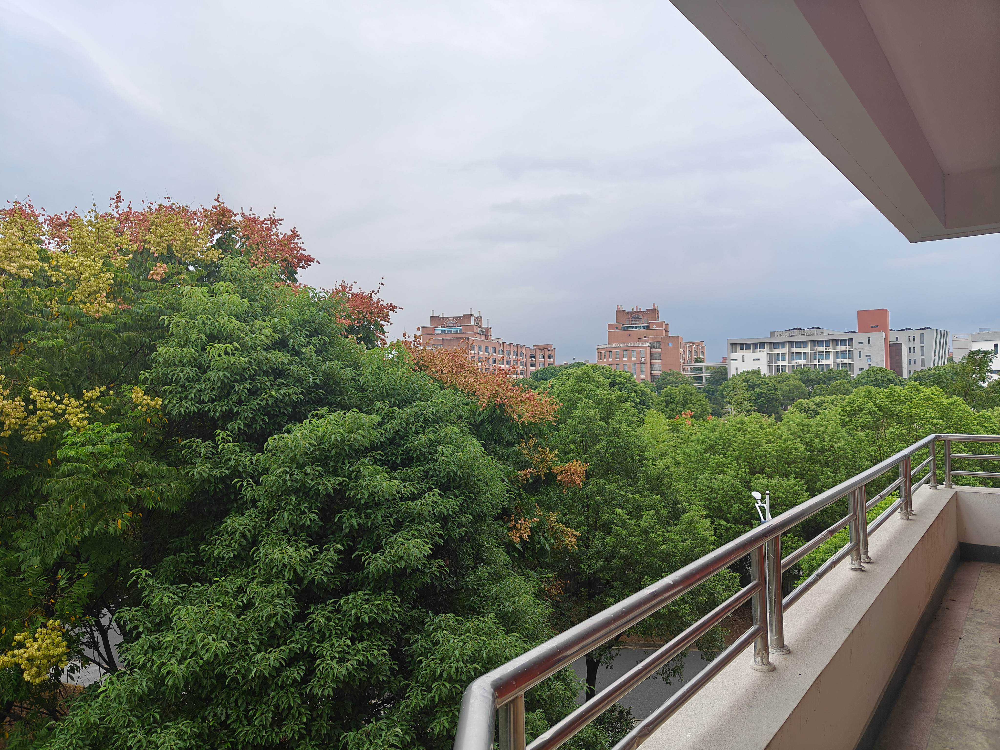
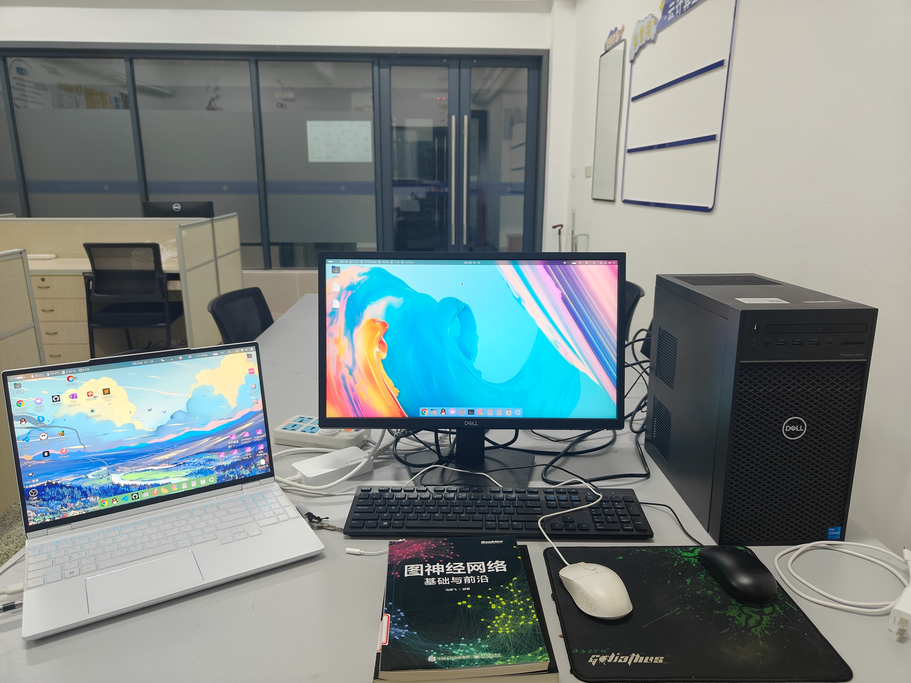
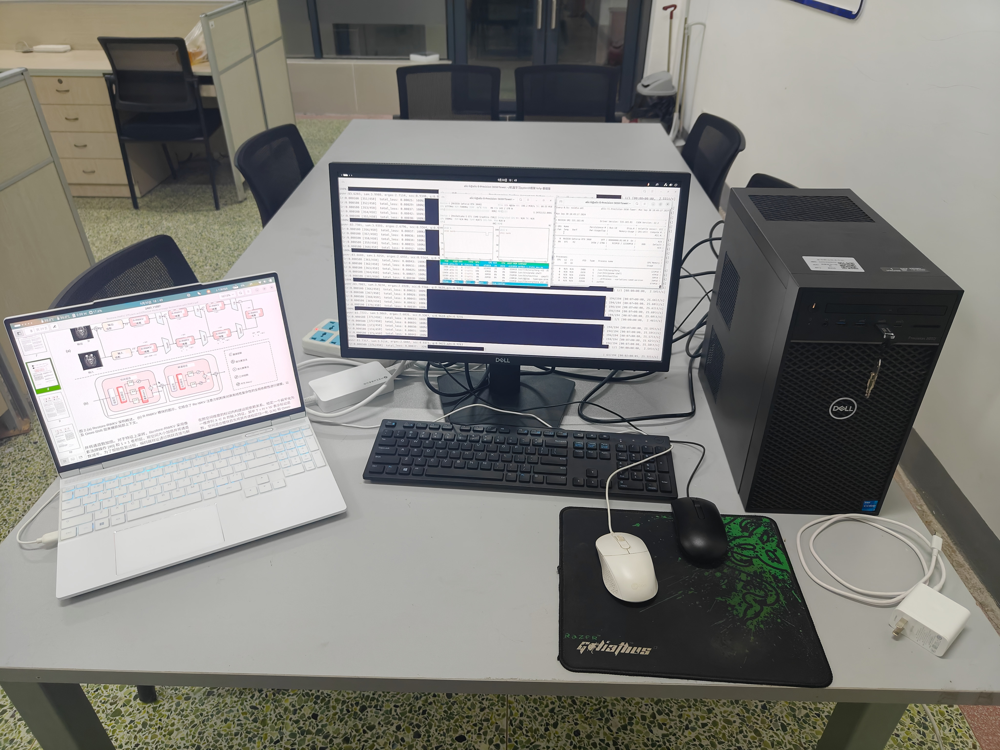
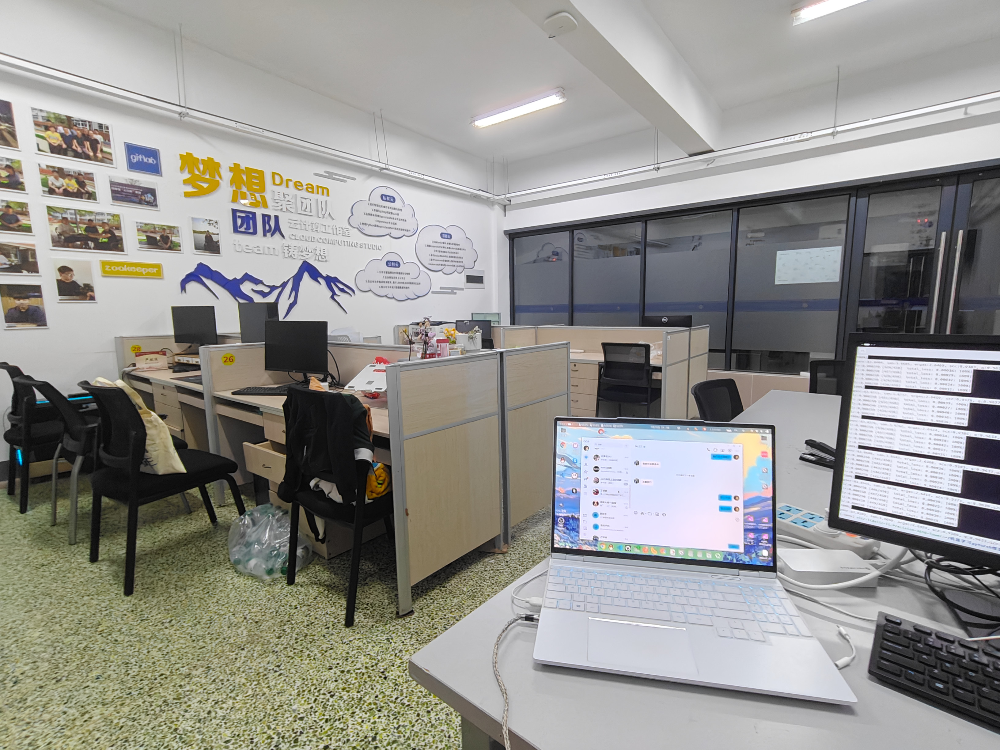

+++
title = "New environment, new beginning! Is this the kind of university that a loser like me can attend?"
date = 2024-10-02T12:51:13+08:00
draft = false
categories = [
    "大学",
    "新起点",
    "废物",
    "Linux",
    "工作室",
    "GPU",
    "中式教育"
]
tags = [
    "大学",
    "新起点",
    "废物",
    "Linux",
    "工作室",
    "GPU",
    "中式教育"
]  
image = "jhc.jpg"
+++
#### Oh~ Today is October 2~~~🤔

- I am the only office worker who was in school on October 1st, but I feel comfortable in the studio. I can do what I like by myself. In fact, I don’t want to go home. It’s good to be alone in school. I am also happy to be alone in the studio doing what I like in school🤗. There is no disturbance from others, away from the hustle and bustle. When I am tired, I can ride a bicycle in this huge school to enjoy the scenery. 😊 I have been to this school for half a month and I still haven’t figured out the map. I have only been to the college teaching building, dormitory, cafeteria, Luckin Coffee shop on campus☕, and the shortcut to my studio in the School of Information Engineering. 🤓

#### Wow! They are both doctors! Great~😋
- I still remember that I was lucky enough to meet Dr. Lu and Dr. Liu on my first day of reporting. It was a kind of fate. I was so happy~😆
- I thought that our school didn't have a deep learning studio or laboratory team, but it turned out that there are some, but they generally don't recruit students. This studio was just established this year. There are two doctors, several professors😳, and two senior undergraduates. Although they are preparing for postgraduate entrance examinations now, they will not come. After all, their own future is more important at this time. 😊
- I had a good chat with Dr. Lu on the first day of reporting. He also copied one of his projects to me on the spot and asked me to run it. The code is really well written. After some adjustments on my card, it can run and practice. He is doing image fusion, which is simply super resolution. It happened that I was also quite interested in this field. At that time, I was directly pulled into the team by Dr. Lu, and the studio door of my campus card was opened by the way. 🤗
- I'm so happy! I have a place to study and research seriously. I'd like to thank Dr. Lu and Dr. Liu!😉 

#### The studio is great~😋
- The studio is in the School of Information Engineering. There is Dr. Lu's deep learning training machine. When I went there, I was given a deep learning machine for the school's artificial intelligence major. It has the 11th generation 11500 plus the 12G version of RTX3060. Although it doesn't have as much video memory as the W7900 that Su Ma gave me, it is Uncle Huang's card after all. The cuda ecosystem is really worry-free and easy to use. I like it very much. 😝
- This machine was originally installed with win10. I thought about it and decided to install a standard Ubuntu24.04. However, Ubuntu22.04 is actually the most user-friendly and compatible one. However, I still installed Ubuntu24.04🫠 and found that the compatibility of the TensorFlow environment would be problematic. However, we don’t need TF, we only need Pytorch. Isn’t installing Torch as easy as drinking water? 😉 Just install it and it’s done. After all, I’m still an AMD ROCm beginner. I can quickly deploy AMD environments. Uncle Huang’s is still too simple😊. I first installed a cuda12.4. The cuda12.6 driver is still not very stable. My brother Ji’s laptop was blown up by it🤣
- 
- 
- 

##### It feels weird
- By the way, that studio seems to be the desk of Dr. Lu and Dr. Liu. I always feel a little weird working in the office, two doctors giving two-on-one tutoring? ? ? 😋 I always feel like I was doing homework in the office when I was a kid. It was quite embarrassing when the students in their class came in and found me sitting there😂
- 

##### "Advanced material, rotten spirit"
- 
- But it's also quite sad. Most college students now have empty hearts and no interests or hobbies at all. Just like a classmate of mine in the same class before me, I took a year off. He went to college one year earlier than me. He was from a private college. After one year of studying, he found that he was living like a zombie. He didn't know what he wanted to do in the future. He just wanted to graduate and get a certificate to make a living. 🤐
- Most people have been brainwashed by Chinese education and become oxen and horses🐮🐴. Learning is all utilitarianism. It's really hard to describe, but there's nothing we can do about it. . . 😔
- They don't really want to do anything, they just watch TikTok and play games, and they don't even want to play games in the end. The spiritual world is already the same as in Cyberpunk 2077, with only a word of zombies left, and the spiritual world is completely rotten. 😮‍💨
- Just like the air raid sirens on September 18th, the outside was ringing, the teachers inside were still teaching, and the students were listening there without spirit, as if their backbones had been taken out. 😟
- But I came from the opposite of Chinese education, of course it would be more painful, so I won't mention the past. . . 😰

#### But we absolutely can't do this! The future of this world is ours after all!!!
- 
#### In this school, I still saw the advanced spiritual qualities of our new generation of youth. 🫤
- For example, the supermarket in our school is unmanned, and all are self-service online payment by scanning the code, and even WeChat face payment can be used. In this way, it is not necessarily that someone will be dishonest. Of course, the education we millennials have received since childhood has made most of us simple and kind. 🙂
- The cafeteria is also unsupervised. Since it is a public school, the cafeteria is subsidized by the national price supervision. This is the first time I have eaten a meat bun worth one yuan since I was very young. I remember that my family was very poor when I was a child. Meat buns were a luxury and basically did not buy them. I grew up eating rice with my grandparents in the morning. When I was a child, I especially wanted to eat meat buns every day. Now I can finally eat meat buns every day to realize my childhood wish. 🥰
- 

- So the spiritual realm of the post-00s is really high, but it is oppressed into this mental state by the reality of this society. Alas~ I can only understand it myself. 😔

#### Good! It's the library~😍
- 
- I've been to the library of my school, and the books I borrowed were all brand new. No one has borrowed them before. It seems that no one in our school really does this😂. Many people in the library are working hard to get a bachelor's degree. There's nothing I can do. I'm a loser😟. I can't get into the undergraduate program. It seems that I was admitted through recommendation, and I didn't even take the college entrance examination. There's nothing I can do. After all, our academic qualifications determine everything. Low academic qualifications mean no ability😮‍💨, just like what our so-called experts say, high academic qualifications do not necessarily mean high ability, but low academic qualifications definitely mean no ability. Everyone is crazy about academic qualifications for the resources and diplomas of Chinese education, but we have to do this, including me. . . 😂

#### I seem to have been played badly too~ 🥵
- 
- 
- I am actually almost done for, I have become addicted to Linux. N card + Win11 is a serious scientific research expert🤓, N card + Linux is a serious scientific research person of Micro M, then my A card + Linux is a pure M plus idiot🤪. It's all AMD's fault! But, I am probably still crazy... 🫨When using Linux to work, I will have strange feelings and thoughts🥵, I have this in my life... 🤣