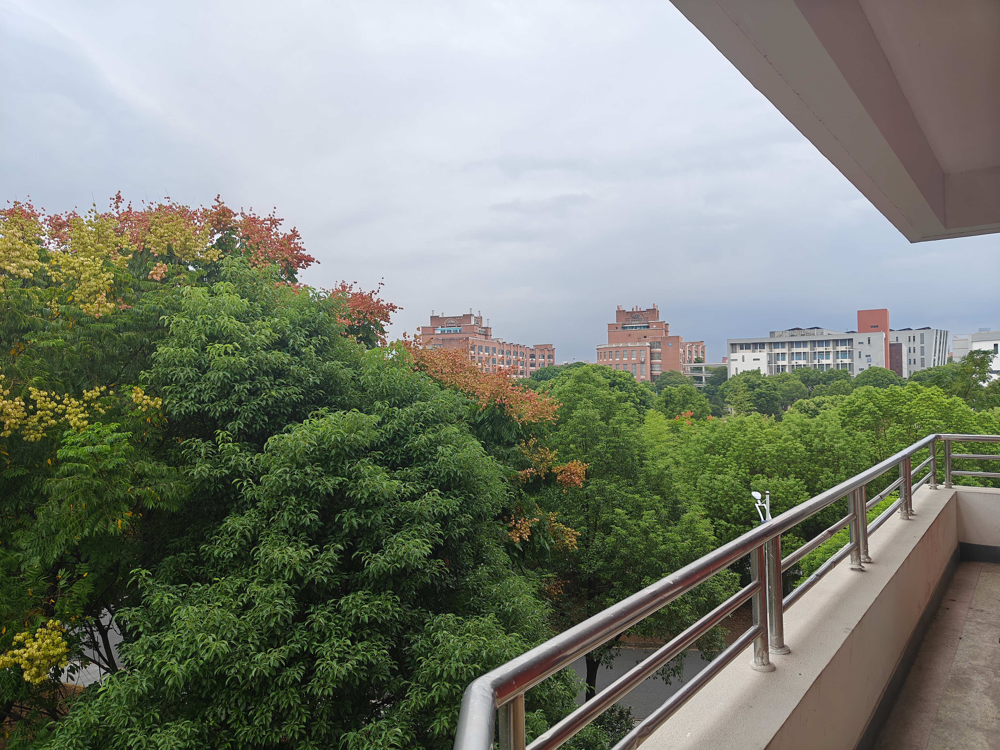
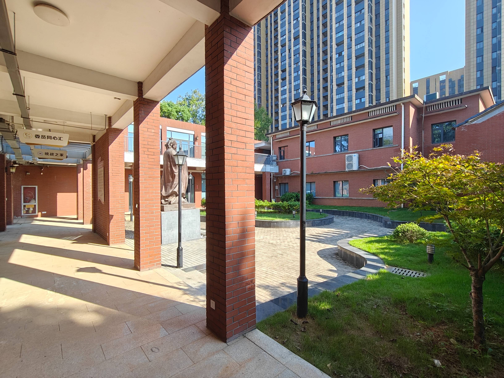
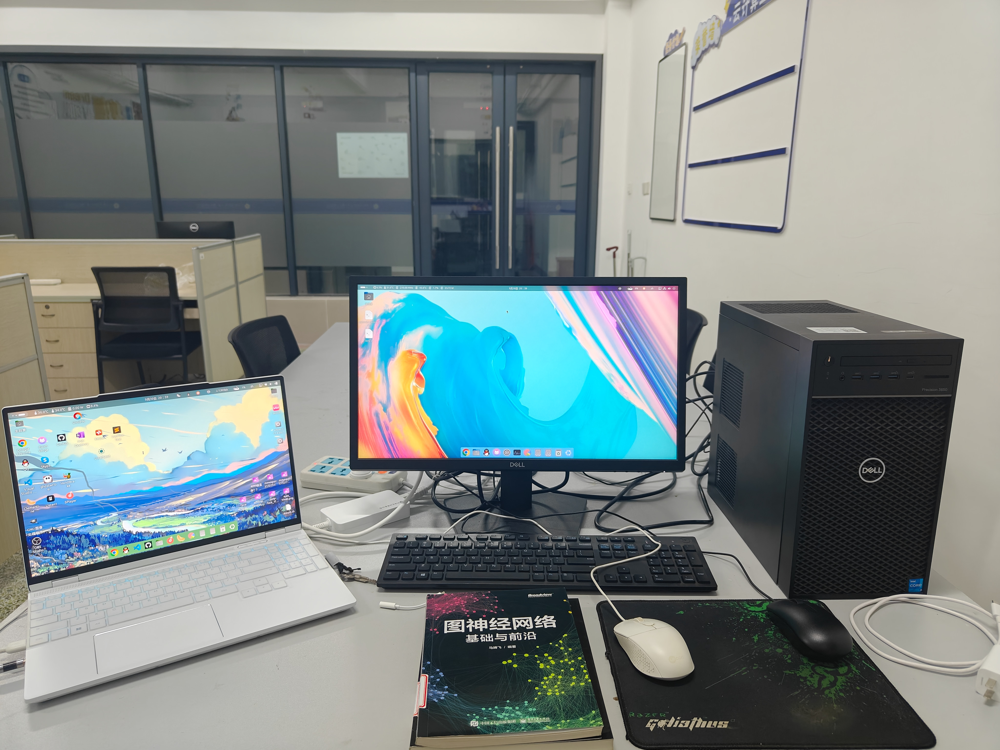
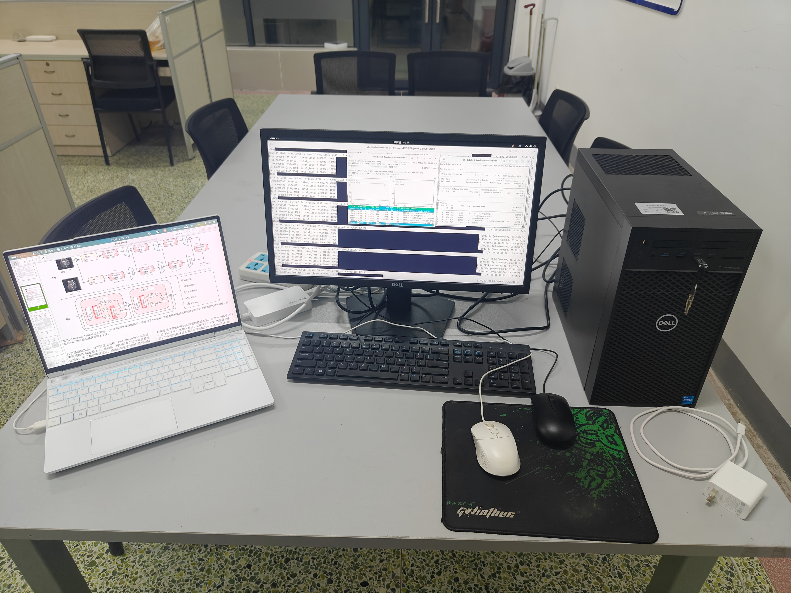
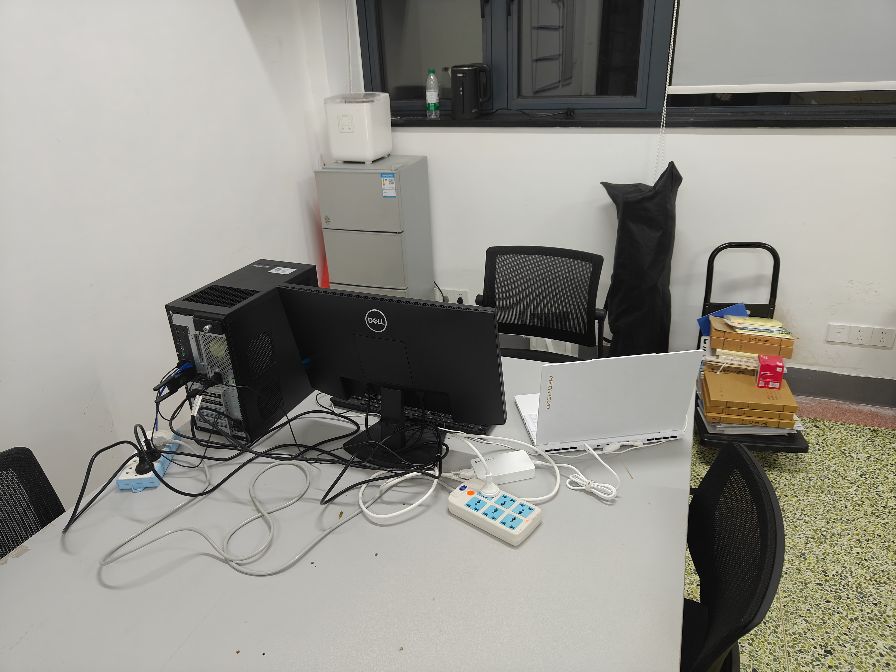
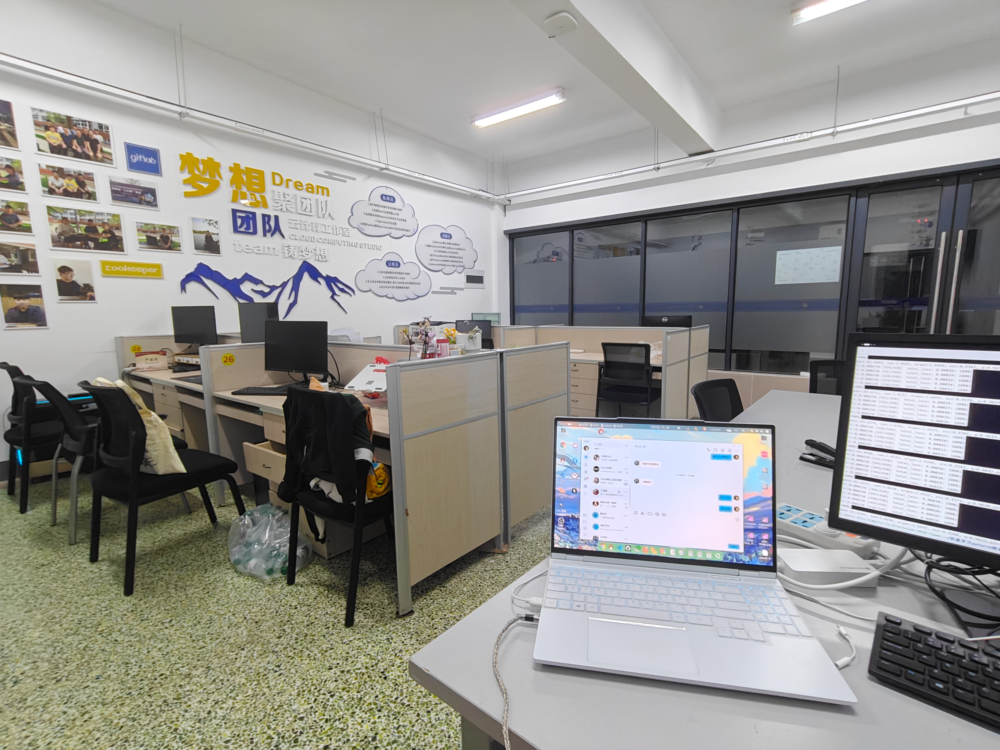
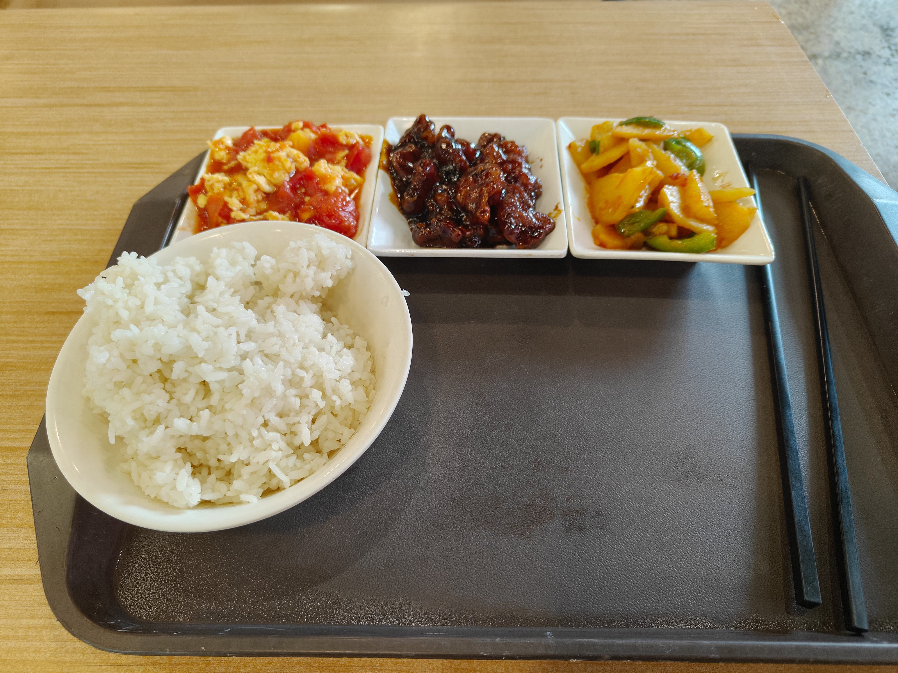

+++
title = "新的环境，新的开始！这就是当代我这种废物上的大学吗？"
date = 2024-10-02T12:51:01+08:00
draft = false
categories = [
    "大学",
    "新起点",
    "废物",
    "Linux",
    "工作室",
    "GPU",
    "中式教育"
]
tags = [
    "大学",
    "新起点",
    "废物",
    "Linux",
    "工作室",
    "GPU",
    "中式教育"
]  
image = "jhc.jpg"
+++
#### 诶~今天是10月2号了欸~~~🤔

- 就我一社畜10月1号在学校里面的，但话说能泡工作室我也觉得挺舒服的，能够一个人做着自己喜欢的事情，其实我也不太想回家，自己一个人待在学校里面还是不错的，在学校里面一个人待在工作室里面做自己喜欢的事情我也蛮开心的🤗，没有别人的打扰，远离尘嚣，累了还可以骑自行车在这个超大的学校里面兜兜风，看看风景。😊来这学校半个月了我都还没有摸清楚地图也是没谁了，这几天只去过学院教学楼，寝室，食堂，校内的瑞幸咖啡店☕，还有去信工学院我所在工作室的捷径。🤓

#### 哇哦！他们两个是博士欸！好棒～😋
- 我还记得我第一天报道的时候我就特别幸运地遇到了卢博士和刘博士，这也算是一种缘分吧，超开心的捏~😆
- 我本来还以为我们学校没有深度学习的工作室或实验室的团队，结果发现还是有的，但是他们一般不招学生，这个工作室也是今年刚刚成立的，那里面一共两个博士，好几个教授😳，还有两个大四的本科生虽然他们两个现在在考研了，也就不来了，毕竟这时候还是自己的前途更重要。😊
- 开学报道的那一天我和卢博士聊得还蛮欢的，他也当时现场拷贝给了我一个他的项目让我去跑，代码写的确实挺不错的，我的卡上面经过一些调整也是能跑能练的，他是做图像融合的，简单来说就是超分辨率，正好我也对这个领域蛮感兴趣的，当时就直接被卢博拉入团队了，顺便把我的校园一卡通的工作室门禁开了。🤗
- 真的好开心! 能够有一个地方给我去静下来进行认真学习和研究，这里真的特别感谢卢博士和刘博士!😉  

#### 工作室好耶～😋
- 工作室就在信工学院里面，里面有卢博的深度学习训练机器，我去了就直接给我了一台学校人工智能专业的深度学习的机器，里面是十一代11500加上12G版本的RTX3060，虽然没有苏妈给我的W7900显存大，但是毕竟是黄舅舅的卡，cuda生态是真的省心好用，蛮喜欢的。😝
- 这台机器本来装的是win10，我想了一下还是来个标准的Ubuntu24.04吧，但是其实Ubuntu22.04才是最好用兼容性最好的，但是我还是装了一个Ubuntu24.04🫠，结果发现TensorFlow环境兼容性就会有问题了，但是我们不用TF，只要Pytorch即可，装Torch不就和喝水一样简单吗？😉随便装装就搞定了，毕竟我还是AMD的ROCm入门的，AMD的环境部署都可以速通了，黄舅舅的还是太简单了😊，先来了一个cuda12.4，cuda12.6驱动还是不太稳定，本人的鸡哥笔记本就是被它爆破的🤣。
- 
- 
- 

##### 感觉怪怪的
- 话说那个工作室好像是卢博士和刘博士的办公桌诶。我这在办公室干活总感觉有点怪怪的，两位博士二对一辅导？？？😋总有一股小时候在办公室补作业的感觉，他们班的学生进来发现我坐在那边蛮尴尬的😂
- 

##### "超前的物质，腐烂的精神"
- 
- 但是说来也挺可悲的，现在绝大多数大学生的心里面都很空虚，根本就没有什么兴趣爱好，就像我之前同一届的一个同学一样我休学了一年，他比我先读大学一年，他是民办三本，读了一年发现自己活得像一具行尸走肉一样，根本就不知道自己之后想要做什么，只想毕业混一本证去混口饭吃。🤐
- 大多数人被中式教育洗脑成了牛马🐮🐴，学习全都是功利主义，实在无法言喻，但是也没什么办法。。。😔
- 他们没什么真正想要做的事情，只会刷抖音，打打游戏，甚至到最后连游戏都不想玩了。精神世界已经跟赛博朋克2077里面的一样，只剩下一句行尸走肉，精神世界完全腐烂。😮‍💨
- 就像之前9月18号的防空警报一样，外面在响，里面的老师还在那接着上课，学生也毫无精神的在那边听着，仿佛脊梁骨已经被抽掉了一样。😟
- 不过我是反着中式教育来的，当然这样会更加痛苦，往事就不提了。。。😰

#### 但是，我们绝对不能这样! 这个世界的未来终究是我们的!!!
- 
#### 在这个学校里面我还是看到了我们新一代青年先进的精神品质的。🫤
- 比如说我们学校里面的超市是无人售货的，都是自助扫码网络支付，甚至还可以微信刷脸支付，这样也不见得有人会不守信用，当然我们千禧一代可能从小接受的教育让我们大多数人变得单纯善良。🙂
- 食堂也是无人监督的，由于是公立的学校，食堂是由国家物价监管补贴的，我现在也是继我很小的时候头一回再吃到一块钱的肉包，记得我小时候家里面特别穷，肉包是奢侈品，基本不买，从小就和爷爷奶奶早上吃米饭长大的。小时候特别希望能够天天吃肉包，现在终于可以每天吃肉包实现小时候的愿望了。🥰
- 

- 所以说00后的精神境界真的很高了，只不过被这个社会现实给压迫成这种精神状态了。唉~只能自己悟。😔

#### 好哦！是图书馆～😍
- 
- 我学校图书馆也去过了，我借的书都是崭新出厂的，没人借过，看来我们学校真的没人搞这个😂。图书馆里面很多人都在努力专升本，没办法，本人废物😟，考不上本科，好像我还是提招进去的，连高考都没考。没办法，我们毕竟学历决定了一切，学历低就是没能力😮‍💨，就像我们的所谓的专家说的话里面的话，学历高不一定能力高，但学历低一定就是没能力。大家为了中式教育下的学历的资源和文凭敲门砖疯狂地卷学历，但是我们也不得不这么做，包括我。。。😂

#### 我也好像被玩坏了惹～ 🥵
- 
- 
- 我其实也快废了，染上了Linux，N卡+Win11是正经科研专家🤓，N卡+linux是微M的正经科研人士，那我这A卡+linux是纯M加大傻逼🤪。都怪AMD!但是， 我大抵还是疯了。。。🫨在使用linux干活时会有奇奇怪怪的感觉和念头🥵，这辈子有了。。。🤣